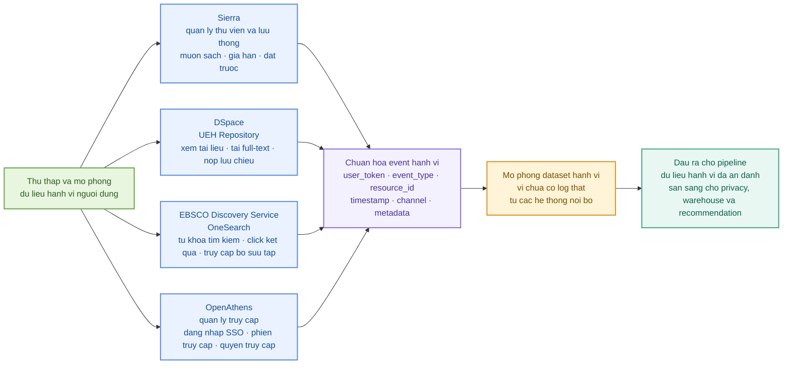

# Phase 1 - Thu Thap Va Mo Phong Du Lieu Hanh Vi Nguoi Dung

## 1. Y Tuong Chinh

Phase 1 duoc dieu chinh theo huong thu thap du lieu hanh vi nguoi dung dua tren 4 he thong thuc te trong UEH Smart Library:

```text
Sierra
DSpace
EBSCO Discovery Service / OneSearch
OpenAthens
```

Bon he thong nay duoc nhac trong bai viet ve Smart Library UEH nhu cac nen tang dich vu thu vien da duoc trien khai de xay dung Thu vien Thong minh UEH.

Trong pham vi demo cua nhom, nhom chua co quyen truy cap log that tu cac he thong nay. Vi vay, Phase 1 nen trinh bay theo huong:

```text
He thong thuc te cua UEH Smart Library
-> loai log hanh vi co the thu thap
-> mock/simulate thanh dataset hanh vi
-> dua vao pipeline Big Data
```

## 2. Flowchart 2D De Dua Vao Bao Cao



## 3. Giai Thich Tung He Thong

### 3.1 Sierra

Sierra la he thong quan ly thu vien, phu hop de thu thap log lien quan den tai lieu ban in va nghiep vu luu thong.

Loai hanh vi co the thu thap:

```text
borrow
return
renew
hold_request
cancel_hold
item_view
```

Y nghia voi bai toan de xuat:

- Biet sinh vien da muon sach nao.
- Biet sach nao duoc gia han nhieu.
- Biet tai lieu nao duoc dat truoc nhieu.
- Dung lam interaction that cho collaborative filtering.

Vi du event:

```json
{
  "user_token": "stu_xxxx",
  "event_type": "borrow",
  "resource_id": "BOOK_123",
  "resource_type": "print_book",
  "timestamp": "2026-06-01T09:20:00",
  "source_system": "sierra"
}
```

### 3.2 DSpace / UEH Repository

DSpace la he thong quan ly tai lieu noi sinh cua UEH Repository. He thong nay phu hop de thu thap hanh vi voi tai lieu so.

Loai hanh vi co the thu thap:

```text
repository_search
view_metadata
open_fulltext
download_pdf
submit_thesis
view_collection
```

Y nghia voi bai toan de xuat:

- Biet sinh vien quan tam den de tai nao.
- Biet tai lieu nao duoc xem/tai nhieu.
- Biet bo suu tap nao phu hop voi tung nganh.
- Ket hop voi metadata nhu title, author, year, collection.

Vi du event:

```json
{
  "user_token": "stu_xxxx",
  "event_type": "download_pdf",
  "resource_id": "UEH/63406",
  "resource_type": "digital_repository",
  "timestamp": "2026-06-01T10:05:00",
  "source_system": "dspace"
}
```

### 3.3 EBSCO Discovery Service / OneSearch

EBSCO Discovery Service la nen tang tim kiem tap trung, trong Smart Library UEH duoc dung de tao thanh cong cu OneSearch.

Loai hanh vi co the thu thap:

```text
search_query
search_result_click
filter_apply
open_database
open_article
```

Y nghia voi bai toan de xuat:

- Biet sinh vien tim kiem tu khoa nao.
- Biet ket qua nao duoc click sau khi search.
- Biet chu de nao co nhu cau cao.
- Dung de xay user interest profile theo keyword/subject.

Vi du event:

```json
{
  "user_token": "stu_xxxx",
  "event_type": "search_result_click",
  "query": "machine learning",
  "resource_id": "EDS_ARTICLE_889",
  "timestamp": "2026-06-01T11:30:00",
  "source_system": "ebsco_onesearch"
}
```

### 3.4 OpenAthens

OpenAthens la he thong quan ly truy cap va xac thuc nguoi dung. He thong nay khong truc tiep cho biet noi dung sinh vien thich, nhung cho biet quyen truy cap va phien truy cap vao tai nguyen dien tu.

Loai hanh vi co the thu thap:

```text
login
logout
access_granted
access_denied
session_start
session_end
database_access
```

Y nghia voi bai toan de xuat:

- Biet nguoi dung co truy cap duoc tai nguyen khong.
- Biet CSDL/tai nguyen nao duoc truy cap nhieu.
- Ho tro Phase 5 khi can kiem tra quyen truy cap digital.
- Ho tro privacy/audit vi day la log lien quan den dinh danh.

Vi du event:

```json
{
  "user_token": "stu_xxxx",
  "event_type": "access_granted",
  "resource_id": "DATABASE_EBSCO",
  "timestamp": "2026-06-01T13:10:00",
  "source_system": "openathens"
}
```

## 4. Bang Tong Hop Cho Bao Cao

| He thong | Vai tro trong Smart Library | Hanh vi nguoi dung co the thu thap | Dong gop cho recommendation |
|---|---|---|---|
| Sierra | Quan ly thu vien va luu thong | Muon sach, tra sach, gia han, dat truoc | Tao interaction that voi sach ban in |
| DSpace | Quan ly tai lieu noi sinh UEH Repository | Xem metadata, doc full-text, tai PDF, nop luu chieu | Tao interaction voi tai lieu so |
| EBSCO Discovery Service / OneSearch | Tim kiem tap trung tren nhieu bo suu tap | Tu khoa tim kiem, click ket qua, mo CSDL | Xay dung user interest theo chu de |
| OpenAthens | Xac thuc va quan ly truy cap | Dang nhap, phien truy cap, access granted/denied | Kiem tra quyen truy cap va ho tro audit |

## 5. Cach Ghi Trong Bao Cao

> Trong Phase 1, nhom dieu chinh huong thu thap du lieu theo kien truc thuc te cua UEH Smart Library. Dua tren bai viet ve viec trien khai cong nghe so tai Thu vien Thong minh UEH, bon he thong co the tao ra du lieu hanh vi nguoi dung gom Sierra, DSpace, EBSCO Discovery Service/OneSearch va OpenAthens. Sierra cung cap log lien quan den muon, tra, gia han va dat truoc sach; DSpace cung cap log xem, truy cap va tai tai lieu so tu UEH Repository; EBSCO Discovery Service/OneSearch cung cap log tim kiem va click ket qua; OpenAthens cung cap log dang nhap, phien truy cap va quyen truy cap tai nguyen dien tu.

> Do nhom khong co quyen truy cap log that tu cac he thong noi bo cua UEH, du lieu hanh vi trong demo duoc mo phong dua tren cac loai event co the phat sinh tu bon he thong tren. Moi event duoc chuan hoa ve cau truc gom user_token, event_type, resource_id, timestamp, source_system va metadata. Cach thiet ke nay giup pipeline cua nhom gan hon voi boi canh Smart Library thuc te, dong thoi tao nen tang de mo rong sang mo hinh collaborative filtering nhu Spark ALS khi co du lieu hanh vi that.

## 6. Cau Noi Khi Thuyet Trinh

> Luc dau nhom dung du lieu Tiki va UEH Repository de demo recommendation. Tuy nhien, neu dat vao boi canh UEH Smart Library that, Phase 1 nen bat dau tu du lieu hanh vi nguoi dung. Nhom xac dinh 4 he thong co the sinh ra log hanh vi gom Sierra, DSpace, EBSCO Discovery Service/OneSearch va OpenAthens. Cac log nay cho biet sinh vien tim kiem gi, mo tai lieu nao, muon sach nao, tai PDF nao va co quyen truy cap tai nguyen nao. Trong demo, nhom mo phong cac event nay vi khong co log noi bo that, nhung cau truc pipeline van phu hop de mo rong khi co du lieu that.

## 7. Luu Y De Khong Bi Hoi Kho

Nen noi:

```text
Nhom mo phong hanh vi dua tren 4 he thong thuc te cua UEH Smart Library.
```

Khong nen noi:

```text
Nhom da thu thap log that tu Sierra, DSpace, EBSCO va OpenAthens.
```

Neu giang vien hoi "co du lieu that khong?", tra loi:

> Nhom chua co log hanh vi that do day la du lieu noi bo va nhay cam. Vi vay, nhom chi dung bai viet ve Smart Library UEH de xac dinh cac nguon log hop ly, sau do mo phong dataset phuc vu demo. Trong he thong trien khai that, cac event nay se duoc lay truc tiep tu log cua Sierra, DSpace, EBSCO Discovery Service va OpenAthens sau khi da qua privacy layer.

## 8. Dataset Mo Phong Da Tao Trong Du An

Nhom da tao script:

```text
scripts/simulate_smart_library_behavior.py
```

Lenh chay:

```powershell
python scripts/simulate_smart_library_behavior.py --students 2000 --min-sessions 3 --max-sessions 8
```

Neu may khong nhan lenh `python`, co the chay bang Python trong virtual environment cua du an.

Thu muc output:

```text
outputs/behavior_simulation
```

File output:

```text
smart_library_behavior_events.csv
system_event_summary.csv
event_type_summary.csv
major_behavior_summary.csv
README_behavior_simulation.md
```

Quy mo dataset da sinh:

```text
students = 2,000
events = 80,667
```

Phan bo event theo he thong:

| He thong | So event | Ty le |
|---|---:|---:|
| OpenAthens | 44,032 | 54.58% |
| DSpace / UEH Repository | 15,928 | 19.75% |
| EBSCO Discovery Service / OneSearch | 10,560 | 13.09% |
| Sierra | 10,147 | 12.58% |

Mot so event tieu bieu:

| He thong | Event | So luong | Y nghia |
|---|---|---:|---|
| OpenAthens | login | 11,008 | Sinh vien dang nhap bang SSO |
| OpenAthens | access_granted | 10,613 | Duoc cap quyen truy cap tai nguyen dien tu |
| OpenAthens | access_denied | 395 | Bi tu choi truy cap |
| EBSCO OneSearch | search_query | 5,280 | Sinh vien tim kiem tai nguyen |
| EBSCO OneSearch | search_result_click | 1,782 | Sinh vien click vao ket qua tim kiem |
| DSpace | view_metadata | 3,141 | Xem thong tin tai lieu Repository |
| DSpace | open_fulltext | 3,152 | Mo toan van tai lieu |
| DSpace | download_pdf | 3,198 | Tai file PDF |
| Sierra | item_view | 4,402 | Xem thong tin sach ban in |
| Sierra | hold_request | 2,694 | Dat truoc tai lieu |
| Sierra | borrow | 1,681 | Muon sach |

## 9. Cau Truc File Event

File `smart_library_behavior_events.csv` co cac cot chinh:

| Cot | Y nghia |
|---|---|
| `event_id` | Ma event mo phong |
| `student_token` | Ma sinh vien da an danh |
| `major` | Nganh hoc |
| `cohort` | Khoa nhap hoc |
| `source_system` | He thong sinh event: Sierra, DSpace, EBSCO/OneSearch, OpenAthens |
| `event_type` | Loai hanh vi |
| `resource_type` | Loai tai nguyen: sach in, repository, database |
| `resource_id` | Ma tai nguyen mo phong |
| `resource_title` | Tieu de tai nguyen |
| `query_text` | Tu khoa tim kiem neu co |
| `timestamp` | Thoi diem phat sinh event |
| `session_id` | Ma phien truy cap |
| `channel` | Kenh tuong tac: portal, mobile app, kiosk, remote web |
| `device_type` | Thiet bi truy cap |
| `location_zone` | Khu vuc thu vien hoac remote |
| `access_result` | Ket qua truy cap |
| `duration_seconds` | Thoi luong tuong tac mo phong |
| `interaction_weight` | Trong so hanh vi dung cho recommendation |
| `is_simulated` | Danh dau day la du lieu mo phong |
| `privacy_level` | Muc privacy cua dataset |
| `metadata_json` | Metadata bo sung |

## 10. Doan Bao Cao Cap Nhat

> De mo phong du lieu hanh vi nguoi dung trong boi canh UEH Smart Library, nhom tao dataset synthetic gom 2.000 sinh vien da duoc an danh va 80.667 event hanh vi. Cac event duoc sinh dua tren 4 he thong thuc te cua Smart Library: Sierra, DSpace/UEH Repository, EBSCO Discovery Service/OneSearch va OpenAthens. Moi event bao gom student_token, source_system, event_type, resource_id, timestamp, channel, device_type va interaction_weight. Dataset nay khong phai log that cua UEH, ma la du lieu mo phong dung de minh hoa pipeline Big Data va lam dau vao cho cac buoc privacy, warehouse, analysis va recommendation.

> Trong dataset, OpenAthens chiem ty le event cao nhat vi moi phien truy cap deu tao ra cac log dang nhap, bat dau phien, cap quyen truy cap va ket thuc phien. DSpace mo phong hanh vi xem metadata, mo full-text va tai PDF cua tai lieu so. EBSCO/OneSearch mo phong hanh vi tim kiem, loc va click ket qua. Sierra mo phong hanh vi lien quan den sach in nhu xem sach, dat truoc, muon, gia han va tra sach. Cach mo phong nay giup nhom chuyen bai toan tu matching dua tren metadata sang bai toan co the phat trien thanh collaborative filtering khi co log hanh vi that.
